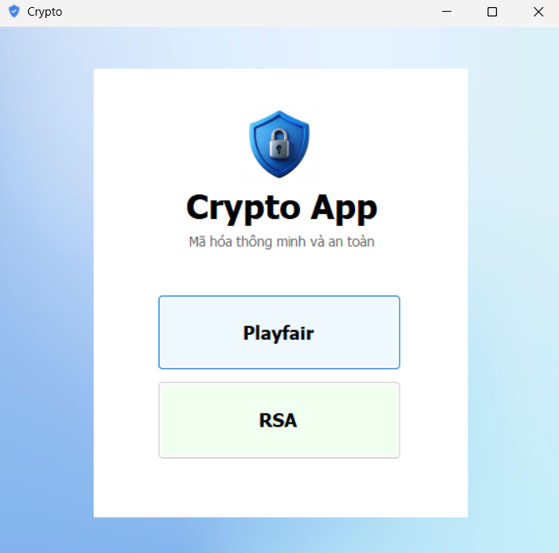
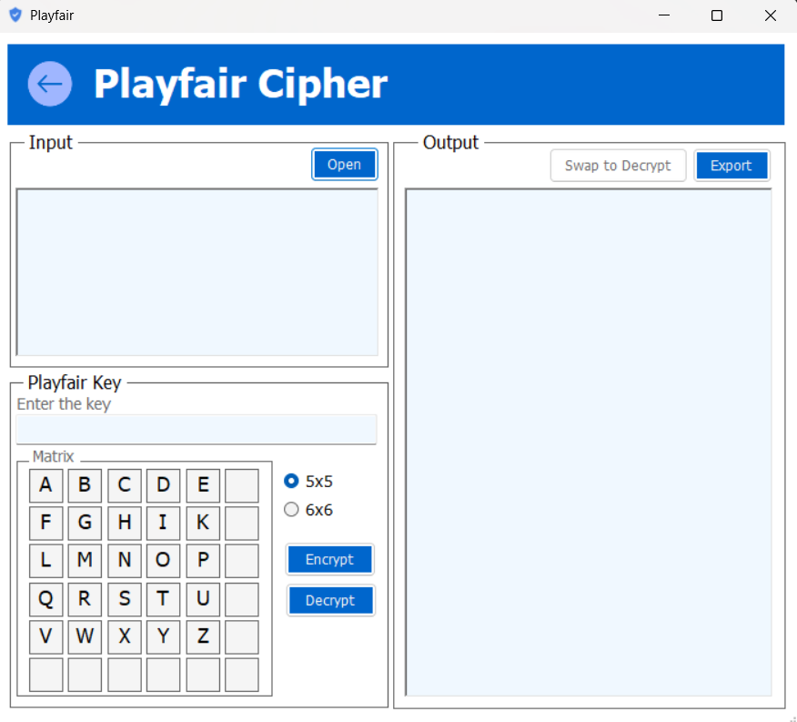
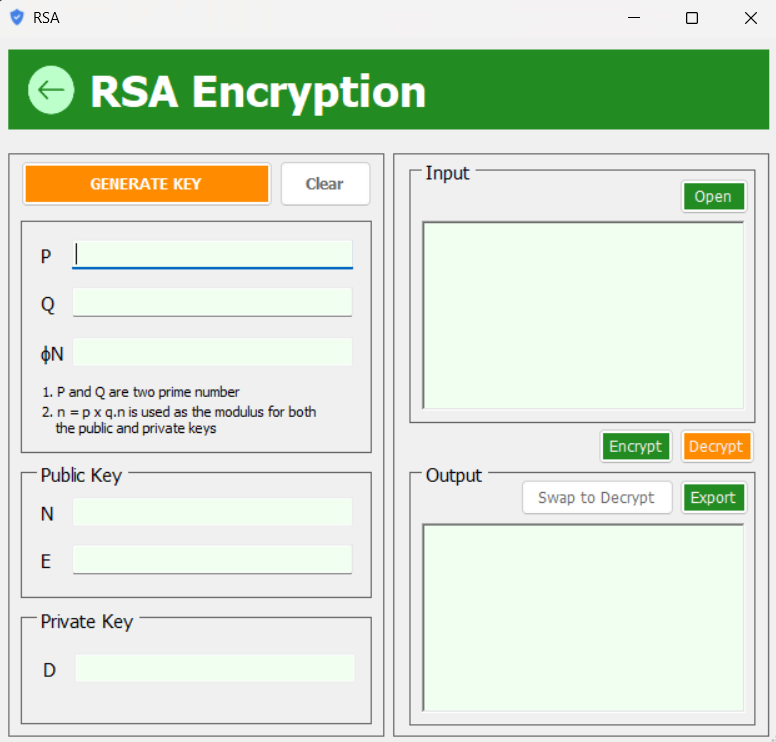

# 🔐 Encryption Algorithms Project (Playfair & RSA)

This project is a **WinForms C# application** that demonstrates two classic encryption algorithms: **Playfair** and **RSA**.✨

---

## 📸 Screenshots

### Main Window

### Playfair Window

### RSA Window

---

## 🧩 Features

### 🔡 Playfair Cipher
- Open an existing file and save the encrypted/decrypted file.  
- Choose **5x5** or **6x6** matrix for encryption.  
- Easy-to-use interface for both encryption and decryption.  

### 🔑 RSA Algorithm
- Open an existing file and save the encrypted/decrypted file.  
- Supports **Vietnamese text encryption**.  
- Simple key management for demonstration purposes.  

---

## 🚀 How to Run
1. Clone or download this repository.  
2. Open the solution in **Visual Studio**.  
3. Build and run the project.  
4. Select either **Playfair** or **RSA** from the main window.  

---

## 🎀 Notes
- This project is for **educational purposes** only.  
- Algorithms are simplified for learning, not for production-level security.  
